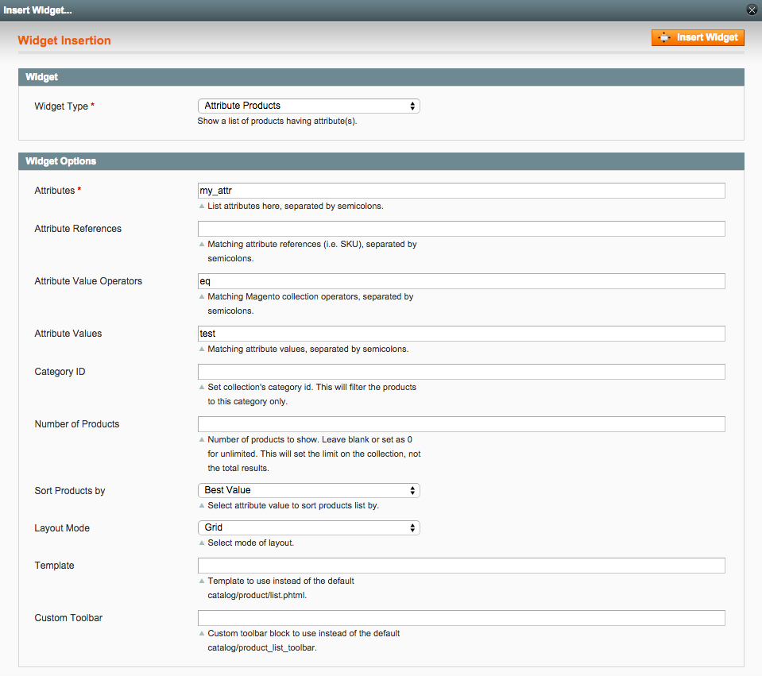

Attribute Products
==================
Widget to show a list of products having an attribute value.

Description
-----------
Show a list of products having an attribute. Specified attribute can also refer to another 
attribute. This widget also has options to configure the toolbar, template and category.

How to use
----------

Upload the extension files to your server. In the admin, under CMS -> Widgets,
add a new widget instance. Configure the widget options:

